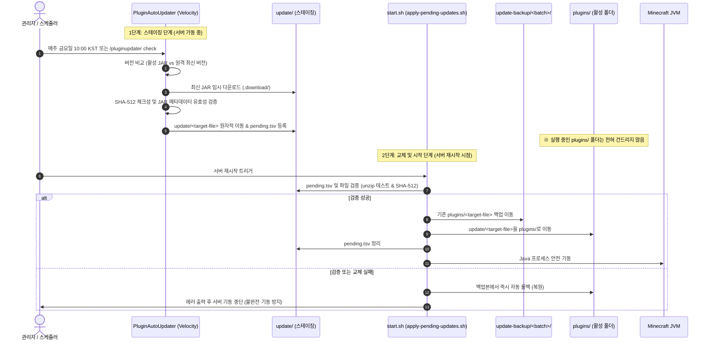

# PluginAutoUpdater 시스템 아키텍처 및 운영 가이드

본 문서는 Velocity 프록시 환경에서 동작하는 **외부 서드파티 플러그인 안전 자동 업데이트 시스템**의 아키텍처, 동작 원리 및 설정 방법을 정리한 문서입니다.

---

## 1. 시스템 핵심 개념 및 아키텍처

`PluginAutoUpdater`는 Velocity 프록시 서버 1곳에서 구동되며, **프록시(Velocity)와 백엔드 서버(Paper/로비)의 외부 플러그인을 중앙 집중식으로 일괄 관리**합니다.

```mermaid
flowchart TB
    subgraph Internet["외부 배포처"]
        LP_API["LuckPerms 공식 API<br/>(metadata.luckperms.net)"]
        LP_CDN["LuckPerms 다운로드 서버<br/>(download.luckperms.net)"]
        Modrinth["Modrinth API & CDN"]
        Spigot["SpigotMC 버전 확인 API"]
    end

    subgraph ProxyServer["Velocity 프록시 (중앙 관제)"]
        Plugin["PluginAutoUpdater<br/>(플러그인 실행 JVM)"]
        ProxyConfig["config.yml<br/>(글로벌 MC 버전 & 플러그인 목록)"]
        ProxyStaging["Proxy/update/<br/>(프록시 대기 폴더 & pending.tsv)"]
        ProxyActive["Proxy/plugins/<br/>(현재 실행 중인 프록시 플러그인)"]
        ProxyScript["Proxy/start.sh<br/>(apply-pending-updates.sh)"]
    end

    subgraph PaperServer["Paper 로비 서버 (백엔드)"]
        PaperStaging["lobby/update/<br/>(로비 대기 폴더 & pending.tsv)"]
        PaperActive["lobby/plugins/<br/>(현재 실행 중인 로비 플러그인)"]
        PaperScript["lobby/start.sh<br/>(apply-pending-updates.sh)"]
    end

    Internet -->|최신 버전 조회 & JAR 다운로드| Plugin
    ProxyConfig -.->|설정 로드| Plugin
    Plugin -->|platform: velocity| ProxyStaging
    Plugin -->|platform: paper (경로 지정)| PaperStaging

    ProxyScript -->|프록시 재시작 시 교체| ProxyStaging
    ProxyScript -->|기존 파일 백업 후 적용| ProxyActive

    PaperScript -->|로비 재시작 시 교체| PaperStaging
    PaperScript -->|기존 파일 백업 후 적용| PaperActive
```

---

## 2. 왜 벨로시티(프록시)는 자동이고, 페이퍼는 경로를 지정해야 하는가?

| 항목 | Velocity (프록시) | Paper (로비) |
| :--- | :--- | :--- |
| **실행 위치** | 업데이터 플러그인이 실행되는 **내부 JVM** | 프록시 외부의 **별도 Java 프로세스** |
| **연결 방식** | 프로세스 자체 접근 | 오직 네트워크 TCP Socket (IP:Port) 통신 |
| **디렉터리 감지** | `@DataDirectory`로부터 상위 2단계 자동 감지 (`Proxy/`) | 프록시가 디스크 경로를 알 수 없음 |
| **설정 필요 여부** | **설정 불필요** (`platform: velocity`) | **설정 필요** (`paper.server-directory: "../lobby"`) |

- **프록시(자기 집)**: 플러그인이 이미 프록시 안에서 구동 중이므로 별도 경로 지정 없이 자기 루트 디렉터리를 100% 자동 인식합니다.
- **페이퍼(옆집)**: 프록시는 페이퍼 서버와 IP로만 연결되어 있어 하드디스크의 폴더 경로를 알 수 없습니다. 따라서 프록시가 페이퍼의 `plugins/` 폴더를 찾을 수 있도록 `paper.server-directory`를 알려주어야 합니다.

---

## 3. 2단계 안전 업데이트 파이프라인

서버가 켜져 있는 동안 실행 중인 JAR 파일을 덮어쓰거나 핫스왑하지 않습니다.



---

## 4. 설정 가이드 (`config.yml`)

경로: `Proxy/plugins/pluginautoupdater/config.yml`

```yaml
# ==============================================================================
# PluginAutoUpdater 설정 파일
# ==============================================================================

# 서버 기본 마인크래프트 버전 (고정값)
# 개별 플러그인에서 minecraft-version을 생략하면 이 버전이 기본으로 적용됩니다.
minecraft-version: "1.21.1"

# Paper(로비) 서버 디렉터리 경로 (Velocity 서버 루트 기준 상대 경로 또는 절대 경로)
paper:
  server-directory: "../lobby"

# 자동 업데이트 대상 플러그인 목록
# [주의] 자체 제작/빌드 플러그인(custom-nickname 등)은 등록하지 마세요.
plugins:
  # 1. LuckPerms: 전용 공식 API 및 CDN 다운로드 서버 사용
  luckperms:
    enabled: true
    platform: paper                        # paper 또는 velocity
    target-file: LuckPerms-Bukkit-5.5.84.jar # plugins/ 폴더에 위치한 현재 활성 JAR 파일명
    source: luckperms                      # luckperms 전용 다운로드 API 사용

  # 2. Modrinth 플러그인 예시
  # viaversion:
  #   enabled: true
  #   platform: paper
  #   target-file: ViaVersion.jar
  #   source: modrinth
  #   project: viaversion
  #   channel: release                     # release, beta, alpha 중 선택 (기본값: release)
  #   # minecraft-version: "1.21.1"        # 생략 시 위의 글로벌 minecraft-version 적용

  # 3. Spigot 버전 확인 예시 (새 버전 알림 로그만 출력)
  # example-spigot:
  #   enabled: false
  #   platform: paper
  #   target-file: ExamplePlugin.jar
  #   source: spigot-check
  #   project: "12345"                     # SpigotMC 리소스 ID
```

### 지원 출처 (source) 상세

1. **`source: luckperms` (LuckPerms 전용 공식 API)**:
   - 메타데이터: `https://metadata.luckperms.net/data/all`
   - 다운로드 서버: `https://download.luckperms.net`
   - 플랫폼에 따라 `bukkit` 또는 `velocity` 전용 빌드를 직접 받아오며, 별도 마인크래프트 버전 설정이 필요 없습니다.
2. **`source: modrinth` (Modrinth API)**:
   - 플랫폼(`loaders`), 마인크래프트 버전(`game_versions`), 릴리즈 채널(`version_type`)을 필터링하여 최신 JAR을 다운로드하고 SHA-512를 대조 검증합니다.
   - `minecraft-version`을 생략하면 글로벌 고정 버전이 자동 적용됩니다.
3. **`source: spigot-check` (SpigotMC)**:
   - Spigot 공식은 자동 다운로드 API를 제공하지 않으므로, 새 버전이 나왔는지 확인하여 콘솔/관리자에게 알림만 전송합니다.

---

## 5. 관리 명령어

Velocity 인게임 또는 콘솔에서 즉시 관리할 수 있는 명령어가 제공됩니다.

| 명령어 | 설명 | 권한 |
| :--- | :--- | :--- |
| `/pluginupdater check` | 등록된 모든 플러그인의 최신 버전을 즉시 비동기로 조회 및 스테이징 | `pluginupdater.admin` |
| `/pluginupdater reload` | `config.yml` 설정을 다시 불러오기 | `pluginupdater.admin` |
| `/pluginupdater status` | 고정 마인크래프트 버전 및 등록된 플러그인 상태 확인 | `pluginupdater.admin` |

*(명령어 별칭으로 `/updater`도 사용 가능합니다)*

---

## 6. 운영 주의사항

> [!IMPORTANT]
> **1. 정확한 `target-file` 파일명 유지**  
> `target-file`은 현재 `plugins/` 폴더에 실제로 존재하는 파일명과 정확히 일치해야 합니다. 교체 시 원본 파일이 백업 디렉터리(`update-backup/<timestamp>/`)로 보관된 후 교체됩니다.

> [!TIP]
> **2. 수동 서버 재시작 권장**  
> 플러그인은 절대 서버를 강제로 재시작하지 않습니다. 업데이트 파일이 `update/`에 준비되면 정기 점검 또는 운영자의 계획된 재시작 시점에 안전하게 적용됩니다.
