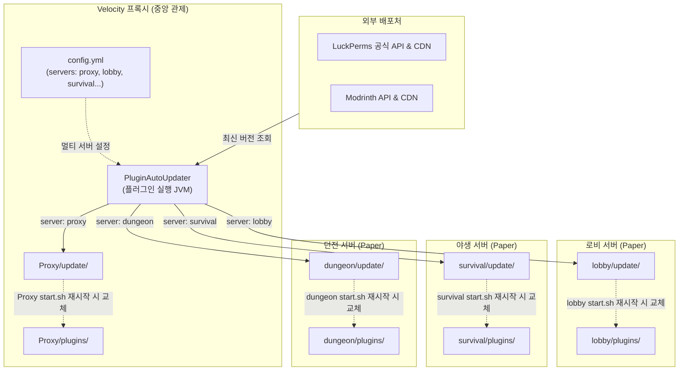

# PluginAutoUpdater 멀티 서버 아키텍처 및 운영 가이드

본 문서는 Velocity 프록시 환경에서 **프록시 및 로비, 야생, 던전 등 여러 개의 백엔드 버킷(Paper) 서버를 한 곳에서 중앙 관리**하는 자동 업데이트 시스템의 아키텍처 및 설정 가이드입니다.

---

## 1. 멀티 버킷 중앙 관리 아키텍처



---

## 2. 멀티 버킷 환경에서의 설정 가이드 (`config.yml`)

경로: `Proxy/plugins/pluginautoupdater/config.yml`

```yaml
# ==============================================================================
# PluginAutoUpdater 설정 파일
# ==============================================================================

# 서버 기본 마인크래프트 버전 (고정값)
minecraft-version: "1.21.1"

# ==============================================================================
# 관리 대상 서버(버킷) 목록 정의
# Velocity 루트(Proxy/) 기준 상대 경로 또는 절대 경로를 지정합니다.
# platform: velocity(프록시 기본) 또는 paper(버킷 기본)
# ==============================================================================
servers:
  proxy:
    directory: "."
    platform: velocity

  lobby:
    directory: "../lobby"
    platform: paper

  survival:
    directory: "../survival"
    platform: paper

  dungeon:
    directory: "../dungeon"
    platform: paper

# ==============================================================================
# 자동 업데이트 대상 플러그인 목록
# ==============================================================================
plugins:
  # 1. 여러 버킷 서버에 공통 적용 (servers에 목록 지정)
  # target-file 생략 시 각 서버의 plugins/ 폴더에 설치된 기존 파일명을 자동 감지하여 덮어씌웁니다.
  luckperms:
    enabled: true
    servers:
      - lobby
      - survival
      - dungeon
    source: luckperms                      # luckperms 전용 다운로드 API 사용

  # 2. 특정 버킷 서버에만 적용 (server: lobby)
  betterhud:
    enabled: true
    server: lobby
    source: modrinth
    project: betterhud
    channel: release

  # 3. 프록시 전용 플러그인 (server: proxy)
  tab:
    enabled: true
    server: proxy
    source: modrinth
    project: tab
    channel: release
```

---

## 3. 새로운 버킷 서버를 추가할 때의 4단계

1. 새 버킷 폴더(예: `../survival`)를 생성하고 마인크래프트 서버를 구성합니다.
2. `scripts/apply-pending-updates.sh`를 `survival/plugin-updater/apply-pending-updates.sh`로 복사합니다.
3. `survival/start.sh`에 Java 실행 직전 스크립트 호출을 추가합니다:
   ```bash
   "$SCRIPT_DIR/plugin-updater/apply-pending-updates.sh" "$SCRIPT_DIR"
   java ... -jar server.jar --nogui
   ```
4. 프록시의 `config.yml`에서 `servers:` 아래에 `survival: "../survival"`을 한 줄 등록합니다.

---

## 4. 재시작 및 적용 독립성

- 각 버킷 서버의 `update/` 폴더와 `pending.tsv`는 **완전히 독립적으로 관리**됩니다.
- 로비 서버를 재시작하면 로비 서버의 플러그인만 교체되며, 야생 서버는 계속 플레이 중이어도 전혀 영향을 받지 않습니다.
- 야생 서버는 야생 서버가 점검/재시작될 때 자기 몫의 `update/` 폴더 내용을 적용합니다.
